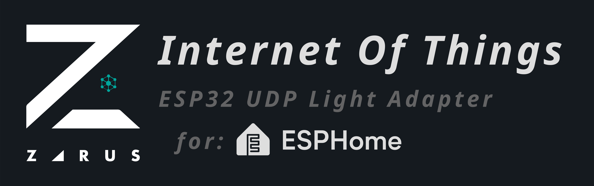

# ESP32 UDP Light Adapter

This component allows an ESPHome device to receive RGB data via UDP and control an addressable LED strip in real time. It is designed for integration with software like LEDFx, music visualization tools, or any controller that sends raw RGB data over UDP.

## Installation

To use this external component in your ESPHome configuration, add the following to your `yaml` file:

```yaml
external_components:
  source:
    type: git
    url: https://github.com/AndresDuran53/esphome_esp32_udp_light
  components: [esp32_udp_light]

# Component configuration
esp32_udp_light:
  id: my_udp_adapter
  port: 21324  # UDP port to listen for RGB data
  light_id: led_strip

# Your LED strip
light:
  - platform: esp32_rmt_led_strip
    id: led_strip
    name: "Strip Lights"
    chipset: ws2811
    pin: GPIO47
    num_leds: 61
    rgb_order: GRB
    effects:
      - addressable_lambda:
          name: "UDP Effect"
          lambda: |-
            if (initial_run) {
              it.all() = Color::BLACK;
              return;
            }
            id(my_udp_adapter).set_effect_active(true);
```

## Usage

Once configured, the component will create a UDP server that listens on the specified port. Any device or software (such as LEDFx) that sends RGB data (3 bytes per LED) to the ESP32 will be able to control the LED strip in real time.

This component is compatible with:
- LEDFx
- Other controllers or software that send RGB data via UDP
- Music/video light synchronization tools

## Configuration Parameters

| Parameter | Type | Required | Description |
|-----------|------|----------|-------------|
| port      | int  | Yes      | UDP port to listen on |
| light_id  | id   | Yes      | ID of the addressable LED strip |

## License

This project is licensed under the MIT License.
